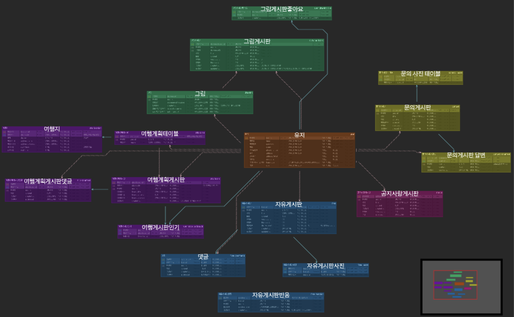
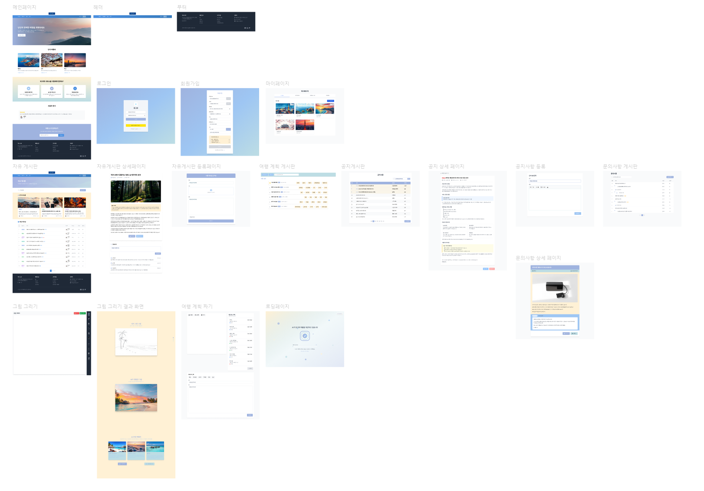

# 🗒️ TripDraw

> **“나만의 여행을 그리고, 기록하고, 공유하세요.”**

---

## 📋 프로젝트 소개

**TripDraw**는 AI 기반 여행 일정 추천과 그림 변환 기능을 결합한 플랫폼입니다.
사용자는 출발지를 입력하고 일수를 선택하면, GPT가 Google Maps 데이터 기반 최적 일정을 생성해주며,
여행 중 찍은 사진은 DALL·E 편집 API로 멋진 일러스트로 변환 후 AWS S3에 저장·관리할 수 있습니다.
완성된 일정과 이미지는 게시판에 공유·조회·댓글·좋아요 기능을 통해 커뮤니티 활동이 가능합니다.

---

## 📁 프로젝트 구조

<pre> ``` 프로젝트 루트/ ├── trip-draw/ # Frontend (Vue + Vite) ├── TripDraw/ # Backend (Spring Boot) └── Database/ # Schema 및 ERD ``` </pre>

---

## 📊 발표 자료

* **About Trip Draw**: [AboutTripDraw.pdf](./docs/aboutTripDraw.pdf)

---

## 📄 초기 기획 (목업 & 기획서)

* **초기 목업 (PDF)**: [TripDraw_기획서.pdf](./docs/mockup.pdf)
* **Figma 목업 링크**: [TripDraw UI 시안 보기](https://www.figma.com/design/C9ph6vuh5RqIeeXPj1tA28/%ED%8A%B8%EB%A6%BD%EB%93%9C%EB%A1%9C%EC%9A%B0?node-id=0-1&t=1jLmgO0leSvL6AIq-1)

---

## 🚀 배포 URL

> 실제 서비스는 다음 링크에서 확인하실 수 있습니다:

🌍 **https://quiet-chaja-5cea12.netlify.app/**

## 🛠️ 기술 스택

* **Frontend**: Vue.js (Vite), Pinia, Tailwind CSS, Swiper
* **Backend**: Spring Boot, Spring Security, Spring AI
* **Database**: MySQL
* **Storage**: AWS S3 (original & GPT 이미지 업로드/호스팅)
* **AI & 외부 API**:

  * OpenAI GPT & DALL·E 편집
  * Google Maps & Places API

---

## 🏗️ 아키텍처

```plaintext
[ Vue.js Frontend ]                              
       ↕ Axios REST                              
[ Spring Boot Backend ]                          
   ↕ MyBatis                               
[ MySQL Database ]                              
       ↕ 외부 API                                
  • OpenAI (GPT, DALL·E)
  • Google Maps / Places
       ↕ AWS S3 (이미지 저장)
```

---

## 설치 & 실행

1. 의존성 설치

   ```bash
   npm install
   npm install vue-router@4 pinia axios swiper
   ```
2. 환경변수 설정 (`.env.local`)

   ```env
   VITE_GOOGLE_MAPS_API_KEY=YOUR_GOOGLE_API_KEY
   ```
3. 개발 서버 실행

   ```bash
   npm run dev
   ```


---

## 📄 API 명세

* [📄 API 명세서 보기](./docs/api.pdf)

---

## 🗺️ ERD



---

## 🎨 UI 기획서 (Mockup & Figma)

* **Figma Prototype**: [TripDraw UI 시안 보기](https://www.figma.com/file/…)
* **목업 화면**

     


본 프로젝트는 여행을 주제로 한 **웹 서비스 "TripDraw"의 UI 시안**을 Figma로 제작한 것입니다.  
사용자 경험을 고려한 설계로, 여행 계획, 게시판, 그림 기반 추천 등 다양한 기능이 포함되어 있습니다.

---

## 👩‍💻 최유리 담당

1. **AI 여행 일정 추천**

   * GPT를 이용한 다일(日)별 HH\:mm–HH\:mm 타임라인 일정
   * Google Places 기반 관광지·식당·카페·숙박·쇼핑 추천
   * 선택 카테고리 필터 & 드래그로 일정 순서 맞춤 편집

2. **지도 & 마커 인터랙션**

   * Vue + Google Maps로 일정 경로 및 POI 시각화
   * 일정 리스트 클릭 시 지도 포커스, InfoWindow에서 일정에 바로 추가

3. **여행 계획 공유 & 게시판**

   * Trip Plans 저장·공유 (planCode)
   * Trip Board: 일정과 함께 게시글 등록, 댓글, 좋아요, 찜(즐겨찾기)

4. **자유 게시판 & 문의**

   * Free Board: 일반 게시글·댓글·이미지 업로드·리액션(LIKE/DISLIKE)
   * Contact: 문의글 작성·댓글(관리자)·이미지 첨부

5. **공지사항 관리**

   * Notice Board: 공지글 CRUD, 조회수·고정 공지 기능

---

## 👨‍💻 김철현 담당

1. **인증 & 유저 관리**

   * JWT 기반 로그인·토큰 리프레시·로그아웃
   * Kakao 소셜 로그인
   * 회원가입 · 이메일 인증 · 아이디/비밀번호 찾기 · 프로필 관리

2. **메인 페이지**

   * 헤더 (네비게이션 바)
   * 푸터 (서비스 정보/링크)

3. **그림 변환 & 게시판**

   * DALL·E 편집 API로 원본 사진 → GPT 스타일 일러스트 변환
   * 그림 기반 여행지 추천
   * Drawing Board: 원본·GPT 이미지 업로드, 좋아요 관리
   * 로딩 페이지 (이미지 처리 대기 중 화면)

4. **배포 & 인프라**

   * AWS Elastic Beanstalk: 백엔드 배포
   * Netlify: 프론트엔드 배포
   * AWS S3: 이미지 저장·호스팅

---

## 💡 향후 계획

* **모바일 앱** (iOS/Android) 네이티브 지원
* **실시간 채팅** 기반 현지 여행 정보 공유
* **여행 후기 리포트** 자동 생성 및 PDF 내보내기
* **멀티미디어 일정**: 동영상·오디오 첨부 기능
* **다국어 지원**: 영어·일본어·중국어 인터페이스

---

> TripDraw와 함께 나만의 완벽한 여행을 설계하고, 추억을 예술로 남겨보세요!
